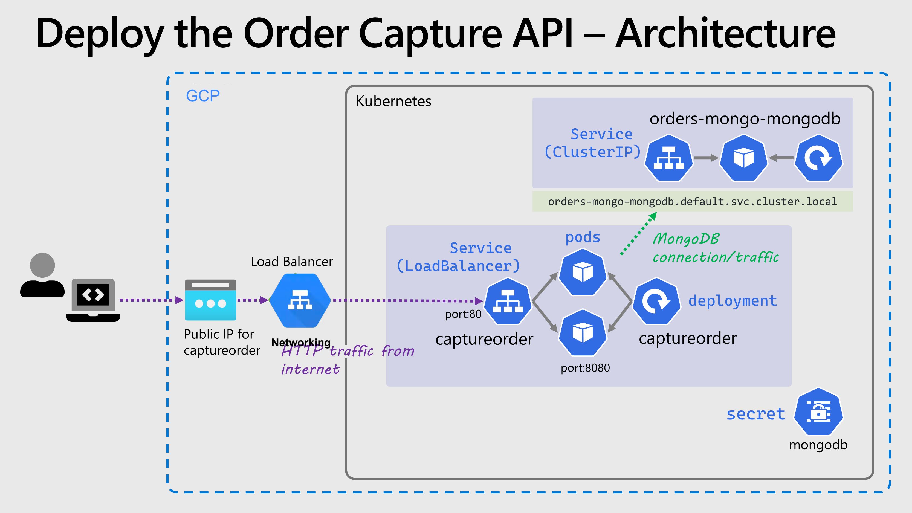

# The Google Kubernetes Engine Workshop

**Welcome to the Google Cloud Kubernetes Workshop. In this lab, you'll go through tasks that will help you master the basic and more advanced topics required to deploy a multi-container application to Kubernetes on [Google Kubernetes Engine (GKE)](https://cloud.google.com/kubernetes-engine/docs/concepts/service?hl=ko).**

**You can use this guide as a Kubernetes tutorial and as study material to help you get started to learn Kubernetes.**

**Some of the things you’ll be going through:**

**- Kubernetes deployments, services and ingress**
**- Deploying MongoDB using Helm version 3**
**- Google Monitor for Containers, Horizontal Pod Autoscaler and the Cluster Autoscaler**

## 1. k8sbasics

There is an assumption of some prior knowledge of Kubernetes and its concepts. If you are new to Kubernetes, start with the [Kubernetes Learning Path](https://kubernetes.io/docs/tutorials/kubernetes-basics/) to learn Kubernetes basics, then go through the concepts of [what Kubernetes is and what it isn't](https://kubernetes.io/docs/concepts/overview/).

- Kubernetes deployments
- Kubernetes services
- Kubernetes ingress

### 1.1. prerequisites

Set up the GKS Cluster
시작하기 전에 다음 태스크를 수행했는지 확인합니다. [GKE Cluster 생성](https://cloud.google.com/kubernetes-engine/docs/deploy-app-cluster?hl=ko)
아래 내용은 대략적인 내용만 담고 있으니 Cluster 생성을 위해서는 공식 문서를 확인 바랍니다.

- gcloud project id 설정
- network 설정
- Google Kubernetes Engine API 사용 설정

```sh
gcloud config set project PROJECT_ID
gcloud container clusters create example-cluster \
    --zone us-central1-a \
    --node-locations us-central1-a,us-central1-b,us-central1-c
```

kubectl 설치 및  클러스터 액스 구성은 다음 문서를 확인합니다. [Kubectl 설치 및 클러스터 액세스 구성](https://cloud.google.com/kubernetes-engine/docs/how-to/cluster-access-for-kubectl?hl=ko)

### 1.2 Application Overview
You will be deploying a customer-facing order placement and fulfillment application that is containerized and is architected for a microservice implementation.


The application consists of 3 components:

* A public facing Order Capture swagger enabled API
* A public facing frontend
* A MongoDB database

### 1.3 Challenges
Useful resources are provided to help you work through each task. If you're working through this as part of a team based hack, ensure you make progress at a good pace by dividing the workload between team members where possible. This may mean anticipating work that might be required in a later task.

> **Hint**: If you get stuck, you can ask for help from the proctors. You may also choose to peek at the solutions.

### Core tasks

Running through this as part of a one day workshop, you should be able to complete all of the **Getting up and running** section. This involves setting up a Kubernetes cluster, deploying the application containers from Docker Hub, setting up monitoring and scaling your application.

### DevOps tasks (To be scheduled)

Once you're done with the Core tasks, next would be to include some DevOps. **Complete as many tasks as you can**. You'll be setting up a Continuous Integration and Continuous Delivery pipeline for your application and then using Helm to deploy it.

### Advanced cluster tasks

If you're up to it, explore configuring the Google Kubernetes Engine with Auto pilot Nodes, enabling MongoDB replication, and using the Google Secret Manager for secrets.

## 2. Getting up and running

### 2.1. Create GKE

Google has a managed Kubernetes service, GKE (Google Kubernetes Engine), we'll use this to easily deploy and standup a Kubernetes cluster.

### Tasks

#### Before you begin

You can check in the link [create a zonnal gke cluster](https://cloud.google.com/kubernetes-engine/docs/how-to/creating-a-zonal-cluster)

Before you start, make sure you have performed the following tasks:
* Enable the Google Kubernetes Engine API.
**Note** [Enable Google Kubernetes Engine API](https://console.cloud.google.com/flows/enableapi?apiid=container.googleapis.com&_ga=2.63667439.1539050351.1679471184-1748947644.1679383172)

* If you want to use the Google Cloud CLI for this task, install and then initialize the gcloud CLI.

#### Create a GKE zonal cluster
Replace the following:

* CLUSTER_NAME: the name of your new cluster.
* CHANNEL: the type of release channel, which can be one of rapid, regular, stable, or None. By default, the cluster is enrolled in the regular release channel if the following flags aren't specified: --cluster-version, --release-channel, --no-enable-autoupgrade, and --no-enable-autorepair.
* COMPUTE_ZONE: the compute zone for the cluster control plane.
* VERSION: the version you wish to specify for your cluster.
* COMPUTE_ZONE,COMPUTE_ZONE1,[...]: the zones in which nodes are created. You can specify as many zones as needed for your cluster. All zones must be in the same region as the cluster's control plane, specified by the --zone flag. For zonal clusters, --node-locations must contain the cluster's primary zone.

In the following commands, you can optionally use the --service-account=SERVICE_ACCOUNT_NAME@PROJECT_ID.iam.gserviceaccount.com flag to specify a different IAM service account that nodes in your cluster's first node pool uses instead of the Compute Engine default service account. This flag is optional, but we strongly recommend that you create and use a minimally-privileged service account so that your nodes don't have more privileges that they require.

##### Using a specific release channel:

To create a new cluster using a specific release channel, run the following command:
```sh 
gcloud container clusters create CLUSTER_NAME \
    --release-channel CHANNEL \
    --zone COMPUTE_ZONE \
    --node-locations COMPUTE_ZONE,COMPUTE_ZONE1
```

##### Using a specific version:
To create a new cluster using a specific cluster version, run the following command:
```sh
gcloud container clusters create CLUSTER_NAME \
    --cluster-version VERSION \
    --zone COMPUTE_ZONE \
    --node-locations COMPUTE_ZONE,COMPUTE_ZONE1
```

#### Using the static default version:
To create a new cluster using the static default cluster version, you don't need to specify a cluster version, but you do need to set the release channel to None:

```sh 
gcloud container clusters create CLUSTER_NAME \
    --release-channel None \
    --zone COMPUTE_ZONE \
    --node-locations COMPUTE_ZONE,COMPUTE_ZONE1
```

#### Example

```sh
gcloud container clusters create example-cluster \
    --zone us-central1-a \
    --node-locations us-central1-a,us-central1-b,us-central1-c
```    


#### Ensure you can connect to the cluster using `kubectl`

**Task Hints**

* `kubectl` is the main command line tool you will be using for working with Kubernetes and GKE. It is already installed in the Google Cloud Shell
* Refer to the GKE docs which includes [Kubectl 설치 및 클러스터 액세스 구성](https://cloud.google.com/kubernetes-engine/docs/how-to/cluster-access-for-kubectl?hl=ko)
* A good sanity check is listing all the nodes in your cluster `kubectl get nodes`.
* [This is a good cheat sheet](https://linuxacademy.com/site-content/uploads/2019/04/Kubernetes-Cheat-Sheet_07182019.pdf) for kubectl.

> **Note** `kubectl`, the Kubernetes CLI, is already installed on the Google Cloud Shell.

1. Install Kubectl

kubectl 구성요소를 설치합니다.
```sh
gcloud components install kubectl
```

2. kubectl version

kubectl version을 확인합니다.
```sh
kubectl version
```
3. Check the nodes

List the available nodes

```sh
kubectl get nodes
```

> **Resources**
> * <https://cloud.google.com/kubernetes-engine/docs/concepts/service?hl=ko>
> * <https://cloud.google.com/kubernetes-engine/docs/how-to/cluster-access-for-kubectl?hl=ko>
> * <https://cloud.google.com/kubernetes-engine/docs/deploy-app-cluster?hl=ko>
> * <https://cloud.google.com/kubernetes-engine/docs/how-to/creating-a-zonal-cluster>
> * <https://console.cloud.google.com/flows/enableapi?apiid=container.googleapis.com&_ga=2.63667439.1539050351.1679471184-1748947644.1679383172>
> * <https://linuxacademy.com/site-content/uploads/2019/04/Kubernetes-Cheat-Sheet_07182019.pdf>


### 2.2. Deploy MongoDB
You need to deploy MongoDB in a way that is scalable and production ready.

**Task Hints**
* Use Helm and a standard provided Helm chart to deploy MongoDB.
* Be careful with the authentication settings when creating MongoDB. It is recommended that you create a standalone username/password. The username and password can be anything you like, but make a note of them for the next task. 

> **Important**: If you install using Helm and then delete the release, the MongoDB data and configuration persists in a Persistent Volume Claim. You may face issues if you redeploy again using the same release name because the authentication configuration will not match. If you need to delete the Helm deployment and start over, make sure you delete the Persistent Volume Claims created otherwise you'll run into issues with authentication due to stale configuration. Find those claims using `kubectl get pvc`.

### Tasks

#### Setup Helm

Helm is an application package manager for Kubernetes, and a way to easily deploy applications and services into Kubernetes, via what are called charts. To use Helm you will need the `helm` command (This is already installed if you're using the Google Cloud Shell).

**Task Hints**
* These instructions use [Helm version 3](https://helm.sh/blog/helm-3-released/).
* Helm version 3 does not come with any repositories predefined, so you'll need initialize the [stable chart repository](https://v3.helm.sh/docs/intro/quickstart/#initialize-a-helm-chart-repository)


Add the `stable` Helm charts repository
`helm repo add stable https://kubernetes-charts.storage.googleapis.com/`

Upate the repositories
`helm repo update`


#### Deploy an instance of MongoDB to your cluster

A standard repository of Helm charts is available for many different software packages, and it has one for [MongoDB](https://github.com/helm/charts/tree/master/stable/mongodb) that is easily replicated and horizontally scalable. 

**Task Hints**
* When installing a chart, Helm uses a concept called a "release" and each release needs a name. We recommend you name your release `orders-mongo` to make it easier to follow later steps in this workshop
* When deploying a chart you provide parameters with the `--set` switch and a comma separated list of `key=value` pairs. There are MANY parameters you can provide to the MongoDB chart, but pay attention to the `mongodbUsername`, `mongodbPassword` and `mongodbDatabase` parameters 

> **Note** The application expects a database named `gkechallenge`. Using a different database name will cause the application to fail!

The recommended way to deploy MongoDB would be to use a Helm Chart. 

```sh
helm install orders-mongo stable/mongodb --set mongodbUsername=orders-user,mongodbPassword=orders-password,mongodbDatabase=gkechallenge
```

> **Hint** Using this command, the Helm Chart will expose the MongoDB instance as a Kubernetes Service accessible at ``orders-mongo-mongodb.default.svc.cluster.local``

Remember to use the username and password from the command above when creating the Kubernetes secrets in the next step.


#### Create a Kubernetes secret to hold the MongoDB details

In the previous step, you installed MongoDB using Helm, with a specified username, password and a hostname where the database is accessible. You'll now create a Kubernetes secret called `mongodb` to hold those details, so that you don't need to hard-code them in the YAML files.

**Task Hints**
* A Kubernetes secret can hold several items, indexed by key. The name of the secret isn't critical, but you'll need three keys to store your secret data:
  * `mongoHost`
  * `mongoUser`
  * `mongoPassword`
* The values for the username & password will be those you used with the `helm install` command when deploying MongoDB.
* Run `kubectl create secret generic -h` for help on how to create a secret, clue: use the `--from-literal` parameter to allow you to provide the secret values directly on the command in plain text.
* The value of `mongoHost`, will be dependent on the name of the MongoDB service. The service was created by the Helm chart and will start with the release name you gave. Run `kubectl get service` and you should see it listed, e.g. `orders-mongo-mongodb`
* All services in Kubernetes get DNS names, this is assigned automatically by Kubernetes, there's no need for you to configure it. You can use the short form which is simply the service name, e.g. `orders-mongo-mongodb` or better to use the "fully qualified" form `orders-mongo-mongodb.default.svc.cluster.local`
  

```sh
kubectl create secret generic mongodb --from-literal=mongoHost="orders-mongo-mongodb.default.svc.cluster.local" --from-literal=mongoUser="orders-user" --from-literal=mongoPassword="orders-password"
```

You'll need to reference this secret when configuring the Order Capture application later on.


> **Resources**
> * <https://helm.sh/docs/intro/using_helm/>
> * <https://github.com/helm/charts/tree/master/stable/mongodb>
> * <https://kubernetes.io/docs/concepts/configuration/secret/>

### Architecture Diagram
Here's a high level diagram of the components you will have deployed when you've finished this section (click the picture to enlarge)

<a href="media/architecture/mongo.png" target="_blank"></a>

* The **pod** holds the containers that run MongoDB
* The **deployment** manages the pod
* The **service** exposes the pod to the Internet using a public IP address and a specified port


### 2.3 Deploy the Order Capture API

You need to deploy the **Order Capture API** application ([azch/captureorder](https://hub.docker.com/r/azch/captureorder/)). This will require an external endpoint, exposing the API so that it can be accessed on port 80. The application will need to write to the MongoDB instance you deployed earlier.

### Container images and source code

In the table below, you will find the Docker container images provided by the development team on Docker Hub as well as their corresponding source code on GitHub.

| Component                    | Docker Image                                                     | Source Code                                                       |
|------------------------------|------------------------------------------------------------------|-------------------------------------------------------------------|
| Order Capture API            | [azch/captureorder](https://hub.docker.com/r/azch/captureorder/) | [source-code](https://github.com/Azure/azch-captureorder)         | 

### Environment variables

The Order Capture API requires the following environment variables in order to connect to your MongoDB database. Make sure you set these environment variables in your deployment. You should use the Kubernetes secrets you created earlier to populate the values in the environment variables.

  * `MONGOHOST="<mongodb hostname>"`
  * `MONGOUSER="<mongodb username>"`
  * `MONGOPASSWORD="<mongodb password>"`

> **Hint:** The Order Capture API exposes the following endpoint for health-checks once you have completed the tasks below: `http://[PublicEndpoint]:[port]/healthz`

### Tasks

#### Deploy the `captureorder` application

**Task Hints**
* Read the Kubernetes docs in the resources section below for details on how to create a deployment. You should create a YAML file and use the `kubectl apply -f` command to deploy it to your cluster
* You provide environment variables to your container using the `env` key in your container spec. By using `valueFrom` and `secretRef` you can reference values stored in a Kubernetes secret (i.e. the one you created earlier with the MongoDB host, username and password)
* The container listens on port 8080 
* If your pods are not starting, not ready or are crashing, you can view their logs and detailed status information using `kubectl logs <pod name>` and/or `kubectl describe pod <pod name>`
* Advanced: You can define a `readinessProbe` and `livenessProbe` using the `/healthz` endpoint exposed by the container and the port `8080`, this is optional but considered to be a best practice
* Advanced: It is best practice to define `requests` and `limits` to control the CPU and memory utilisation of your containers


##### Deployment

Save the YAML below as `captureorder-deployment.yaml` or download it from [captureorder-deployment.yaml](yaml-solutions/01. challenge-02/captureorder-deployment.yaml)

```yaml
apiVersion: apps/v1
kind: Deployment
metadata:
  name: captureorder
spec:
  selector:
      matchLabels:
        app: captureorder
  replicas: 2
  template:
      metadata:
        labels:
            app: captureorder
      spec:
        containers:
        - name: captureorder
          image: azch/captureorder
          imagePullPolicy: Always
          readinessProbe:
            httpGet:
              port: 8080
              path: /healthz
          livenessProbe:
            httpGet:
              port: 8080
              path: /healthz
          resources:
            requests:
              memory: "128Mi"
              cpu: "100m"
            limits:
              memory: "256Mi"
              cpu: "500m"
          env:
          - name: MONGOHOST
            valueFrom:
              secretKeyRef:
                name: mongodb
                key: mongoHost
          - name: MONGOUSER
            valueFrom:
              secretKeyRef:
                name: mongodb
                key: mongoUser
          - name: MONGOPASSWORD
            valueFrom:
              secretKeyRef:
                name: mongodb
                key: mongoPassword
          ports:
          - containerPort: 8080
```

And deploy it using

```sh
kubectl apply -f captureorder-deployment.yaml
```

##### Verify that the pods are up and running

```sh
kubectl get pods -l app=captureorder -w
```

Wait until you see pods are in the `Running` state.

> **Hint** If the pods are not starting, not ready or are crashing, you can view their logs and detailed status information using `kubectl logs <pod name>` and `kubectl describe pod <pod name>`.


#### Expose the `captureorder` deployment with a service

**Task Hints**
* Read the Kubernetes docs in the resources section below for details on how to create a service. You should create a YAML file and use the `kubectl apply -f` command to deploy it to your cluster
* Pay attention to the `port`, `targetPort` and the `selector`
* Kubernetes has several types of services (described in the docs), specified in the `type` field. You will need to create a service of type `LoadBalancer`
* The service should expose port 80
  

##### Service

Save the YAML below as `captureorder-service.yaml` or download it from [captureorder-service.yaml](yaml-solutions/01. challenge-02/captureorder-service.yaml)

```yaml
apiVersion: v1
kind: Service
metadata:
  name: captureorder
spec:
  selector:
    app: captureorder
  ports:
  - protocol: TCP
    port: 80
    targetPort: 8080
  type: LoadBalancer
```

And deploy it using

```sh
kubectl apply -f captureorder-service.yaml
```

##### Retrieve the External-IP of the Service

Use the command below. **Make sure to allow a couple of minutes** for the Google Cloud Load Balancer to assign a public IP.

```sh
kubectl get service captureorder -o jsonpath="{.status.loadBalancer.ingress[*].ip}" -w
```


#### Ensure orders are successfully written to MongoDB

**Task Hints**
* The IP of your service will be publicly available on the internet
* The service has a Swagger/OpenAPI definition: `http://[Your Service Public LoadBalancer IP]/swagger`
* The service has an orders endpoint which accepts GET and POST: `http://[Your Service Public LoadBalancer IP]/v1/order`
* Orders take the form `{"EmailAddress": "email@domain.com", "Product": "prod-1", "Total": 100}` (The values are not validated)
  

> **Hint:** You can test your deployed API with curl, the Order Capture API's Swagger endpoint or a tool such as [Postman](https://www.getpostman.com/)

Send a `POST` request using curl

```sh
curl -d '{"EmailAddress": "email@domain.com", "Product": "prod-1", "Total": 100}' -H "Content-Type: application/json" -X POST http://[Your Service Public LoadBalancer IP]/v1/order
```

You can expect the order ID returned by API once your order has been written into Mongo DB successfully

```json
{
    "orderId": "5beaa09a055ed200016e582f"
}
```


> **Hint:** In the sample solution, we have specified readinessProbe and livenessProbe settings in the YAML file when we're deploying The Order Capture API. In Kubernetes, readiness probes define when a Container is ready to start accepting traffic, liveness probes monitor the container health. Hence here we can use the following endpoint to do a simple health-checks : `http://[PublicEndpoint]:[port]/healthz`

> **Resources**
> * <https://kubernetes.io/docs/concepts/workloads/controllers/deployment/>
> * <https://kubernetes.io/docs/tasks/inject-data-application/define-environment-variable-container/>
> * <https://kubernetes.io/docs/tasks/inject-data-application/distribute-credentials-secure/#define-container-environment-variables-using-secret-data>
> * <https://kubernetes.io/docs/concepts/services-networking/dns-pod-service/>
> * <https://kubernetes.io/docs/concepts/services-networking/service/>
> * <https://kubernetes.io/docs/tasks/access-application-cluster/create-external-load-balancer/#configuration-file>

### Architecture Diagram
Here's a high level diagram of the components you will have deployed when you've finished this section (click the picture to enlarge)

<a href="media/architecture/captureorder.png" target="_blank"></a>


### 2.4 Deploy the frontend using Ingress
You need to deploy the **Frontend** application ([azch/frontend](https://hub.docker.com/r/azch/frontend/)). This requires an external endpoint, exposing the website on port 80 and it needs to connect to the Order Capture API's public IP address so that it can display the number of orders in the system.

We want to access the Frontend application using a DNS hostname rather than an IP address. 

### Container images and source code

In the table below, you will find the Docker container images provided by the development team on Docker Hub as well as their corresponding source code on GitHub.

| Component                    | Docker Image                                                     | Source Code                                                       | 
|------------------------------|------------------------------------------------------------------|-------------------------------------------------------------------|
| Frontend            | [azch/frontend](https://hub.docker.com/r/azch/frontend/) | [source-code](https://github.com/Azure/azch-frontend)         |

### Environment variables

The frontend requires the `CAPTUREORDERSERVICEIP` environment variable to be set to the external public IP address of the `captureorder` [service deployed in the previous step](#retrieve-the-external-ip-of-the-service). **Make sure you set this environment variable in your deployment file.**

  * `CAPTUREORDERSERVICEIP="<public IP of order capture service>"`

### Tasks

#### Deploy the `frontend` application

**Task Hints**
* As with the captureorder deployment you will need to create a YAML file which describes your deployment. Making a copy of your captureorder deployment YAML would be a good start, but beware you will need to change
  * `image`
  * `readinessProbe` endpoint, if you have one (clue use the root url '/')
  * `livenessProbe` endpoint, if you have one (clue use the root url '/')
* As before you need to provide environmental variables to your container using `env`, but this time nothing is stored in a secret
* The container listens on port 8080 
* If your pods are not starting, not ready or are crashing, you can view their logs and detailed status information using `kubectl logs <pod name>` and/or `kubectl describe pod <pod name>`
  

##### Deployment

Save the YAML below as `frontend-deployment.yaml` or download it from [frontend-deployment.yaml](yaml-solutions/01. challenge-02/frontend-deployment.yaml)

```yaml
apiVersion: apps/v1
kind: Deployment
metadata:
  name: frontend
spec:
  selector:
      matchLabels:
        app: frontend
  replicas: 1
  template:
      metadata:
        labels:
            app: frontend
      spec:
        containers:
        - name: frontend
          image: azch/frontend
          imagePullPolicy: Always
          readinessProbe:
            httpGet:
              port: 8080
              path: /
          livenessProbe:
            httpGet:
              port: 8080
              path: /
          resources:
            requests:
              memory: "128Mi"
              cpu: "100m"
            limits:
              memory: "256Mi"
              cpu: "500m"
          env:
          - name: CAPTUREORDERSERVICEIP
            value: "<public IP of order capture service>" # Replace with your captureorder service IP
          ports:
          - containerPort: 8080
```

And deploy it using

```sh
kubectl apply -f frontend-deployment.yaml
```

##### Verify that the pods are up and running

```sh
kubectl get pods -l app=frontend -w
```

> **Hint** If the pods are not starting, not ready or are crashing, you can view their logs and detailed status information using `kubectl logs <pod name>` and `kubectl describe pod <pod name>`.


#### Expose the frontend using a hostname

Instead of accessing the frontend through an IP address, you would like to expose the frontend using a hostname. Explore using [Kubernetes Ingress](https://kubernetes.io/docs/concepts/services-networking/ingress/) to achieve this.

There are many options when considering Kubernetes ingress controllers, including the [Azure Application Gateway Ingress Controller](https://docs.microsoft.com/en-us/azure/application-gateway/ingress-controller-overview)  The most commonly used is the [nginx-ingress](https://github.com/helm/charts/tree/master/stable/nginx-ingress) controller.

> The Ingress controller is exposed to the internet by using a Kubernetes service of type LoadBalancer. The Ingress controller watches and implements Kubernetes Ingress resources, which creates routes to application endpoints.

We can leverage the [nip.io](https://nip.io/) reverse wildcard DNS resolver service to map our ingress controller's `LoadBalancerIP` to a proper DNS name.

**Task Hints**
* When placing services behind an ingress you don't expose them directly with the `LoadBalancer` type, instead you use a `ClusterIP`. In this network model, external clients access your service via public IP of the *ingress controller*, which then decides where to route the traffic within your Kubernetes cluster.
* [This picture helps explain how this works](media/architecture/ingress.png)
* Use Helm to deploy The NGINX ingress controller. [The Helm chart for the NGINX ingress controller](https://github.com/helm/charts/tree/master/stable/nginx-ingress) requires no options/values when deploying it.
* ProTip: Place the ingress controller in a different namespace, e.g. `ingress` by using the `--namespace` option.
* Use `kubectl get service` (add `--namespace` if you deployed it to a different namespace) to discover the public/external IP of your ingress controller, you will need to make a note of it. the
* [nip.io](https://nip.io) is not related to Kubernetes or Azure, however it provides a useful service to map any IP Address to a hostname. This saves you having to create public DNS records. If your ingress controller had IP 12.34.56.78, you could access it via `http://anythingyouwant.12.34.56.78.nip.io`
* The [Kubernetes docs have an example of creating an Ingress object](https://kubernetes.io/docs/concepts/services-networking/ingress/#name-based-virtual-hosting), except you will only be specifying a single host rule. Use nip.io and your ingress controller IP to set the `host` field. As with the deployment and service, you create this object via a YAML file and `kubectl apply`


##### Service

Save the YAML below as `frontend-service.yaml` or download it from [frontend-service.yaml](yaml-solutions/01. challenge-02/frontend-service.yaml)

> **Note** Since you're going to expose the deployment using an Ingress, there is no need to use a public IP for the Service, hence you can set the type of the service to be `ClusterIP` instead of `LoadBalancer`.

```yaml
apiVersion: v1
kind: Service
metadata:
  name: frontend
spec:
  selector:
    app: frontend
  ports:
  - protocol: TCP
    port: 80
    targetPort: 8080
  type: ClusterIP
```

And deploy it using

```sh
kubectl apply -f frontend-service.yaml
```

##### Deploy the ingress controller with Helm

Create a namespace for the ingress

```sh
kubectl create namespace ingress
```

NGINX ingress controller is easily deployed with Helm:

```sh
helm repo update

helm install ingress stable/nginx-ingress --namespace ingress
```

In a couple of minutes, a public IP address will be allocated to the ingress controller, retrieve with:

```sh
kubectl get svc  -n ingress    ingress-nginx-ingress-controller -o jsonpath="{.status.loadBalancer.ingress[*].ip}"
```

##### Ingress

Create an Ingress resource that is annotated with the required annotation and make sure to replace `_INGRESS_CONTROLLER_EXTERNAL_IP_` with the IP address  you retrieved from the previous command.

Additionally, make sure that the `serviceName` and `servicePort` are pointing to the correct values as the Service you deployed previously.

Save the YAML below as `frontend-ingress.yaml` or download it from [frontend-ingress.yaml](yaml-solutions/01. challenge-02/frontend-ingress.yaml)

```yaml
apiVersion: extensions/v1beta1
kind: Ingress
metadata:
  name: frontend
  annotations:
    kubernetes.io/ingress.class: nginx
spec:
  rules:
  - host: frontend._INGRESS_CONTROLLER_EXTERNAL_IP_.nip.io
    http:
      paths:
      - backend:
          serviceName: frontend
          servicePort: 80
        path: /
```

And create it using

```sh
kubectl apply -f frontend-ingress.yaml
```


#### Browse to the public hostname of the frontend and watch as the number of orders change

Once the Ingress is deployed, you should be able to access the frontend at <http://frontend.[cluster_specific_dns_zone]>, for example <http://frontend.52.255.217.198.nip.io>

If it doesn't work on the first attempt, give it a few more minutes or try a different browser.

Note: you might need to enable cross-site scripting in your browser; click on the shield icon on the address bar (for Chrome) and allow unsafe script to be executed. 


> **Resources**
> * <https://kubernetes.io/docs/concepts/workloads/controllers/deployment/>
> * <https://kubernetes.io/docs/concepts/services-networking/service/>
> * <https://kubernetes.io/docs/concepts/services-networking/ingress/>
> * <https://kubernetes.io/docs/concepts/services-networking/ingress-controllers/>

### Architecture Diagram
Here's a high level diagram of the components you will have deployed when you've finished this section (click the picture to enlarge)

<a href="media/architecture/frontend.png" target="_blank"></a>

### 2.5 Enable TLS (SSL) on ingress
You want to enable secure connections to the Frontend website over TLS (SSL). In this task, you'll use [Let's Encrypt](https://letsencrypt.org/)'s free service to generate valid TLS certificates for your domains, and you'll integrate the certificate issuance workflow into Kubernetes.

### Tasks

#### Install `cert-manager`

[cert-manager](https://github.com/jetstack/cert-manager) is a Kubernetes add-on to automate the management and issuance of TLS certificates from various issuing sources. It will ensure certificates are valid and up to date periodically, and attempt to renew certificates at an appropriate time before expiry.

**Task Hints**
* As with MongoDB and NGINX use Helm to deploy cert-manager. You need to do a little more than just `helm install`, however the [steps are documented in the GitHub repo for the cert-manager chart](https://github.com/helm/charts/tree/master/stable/cert-manager#installing-the-chart)
* It's recommended to install the chart into a different/name namespace


Install **cert-manager** using Helm and configure it to use `letsencrypt` as the certificate issuer.

```sh
# Install the CustomResourceDefinition resources separately
kubectl apply --validate=false -f https://raw.githubusercontent.com/jetstack/cert-manager/release-0.11/deploy/manifests/00-crds.yaml

# Create the namespace for cert-manager
kubectl create namespace cert-manager

# Add the Jetstack Helm repository
helm repo add jetstack https://charts.jetstack.io

# Update your local Helm chart repository cache
helm repo update

# Install the cert-manager Helm chart
helm install cert-manager \
  --namespace cert-manager \
  jetstack/cert-manager
```


#### Create a Let's Encrypt ClusterIssuer

In order to begin issuing certificates, you will need to set up a `ClusterIssuer`.

**Task Hints**
* cert-manager uses a custom Kubernetes object called an **Issuer** or **ClusterIssuer** to act as the interface between you and the certificate issuing service (in our case Let's Encrypt). There are many ways to create an issuer, but [the cert-manager docs provides a working example YAML for Let's Encrypt](https://cert-manager.readthedocs.io/en/latest/reference/issuers.html#issuers). It will require some small modifications, **You must change the type to `ClusterIssuer` or it will not work**. The recommendation is you call the issuer `letsencrypt`
* Check the status with `kubectl describe clusterissuer.cert-manager.io/letsencrypt` (or other name if you didn't call your issuer `letsencrypt`)


Save the YAML below as `letsencrypt-clusterissuer.yaml` or download it from [letsencrypt-clusterissuer.yaml](yaml-solutions/advanced/letsencrypt-clusterissuer.yaml).

> **Note** Make sure to replace `_YOUR_EMAIL_` with your email.

```yaml
apiVersion: cert-manager.io/v1alpha2
kind: ClusterIssuer
metadata:
  name: letsencrypt
spec:
  acme:
    server: https://acme-v02.api.letsencrypt.org/directory # production
    #server: https://acme-staging-v02.api.letsencrypt.org/directory # staging
    email: _YOUR_EMAIL_ # replace this with your email
    privateKeySecretRef:
      name: letsencrypt
    solvers:
       - http01:
           ingress:
             class:  nginx
```

And apply it using

```sh
kubectl apply -f letsencrypt-clusterissuer.yaml
```


#### Update the ingress resource to automatically request a certificate

Issuing certificates can be done automatically by properly annotating the ingress resource.

**Task Hints**
* You need to make changes to the frontend ingress, you can modify your existing frontend ingress YAML file or make a copy to a new name
* [The quick start guide for cert-manager provides guidance on the changes you need to make](https://cert-manager.readthedocs.io/en/latest/tutorials/acme/quick-start/index.html#step-7-deploy-a-tls-ingress-resource). Note the following:
  * The annotation `cert-manager.io/issuer: "letsencrypt-staging"` in the metadata, you want that to refer to your issuer `letsencrypt` and use cluster-issuer rather than issuer, e.g. `cert-manager.io/cluster-issuer: "letsencrypt"`
  * The new `tls:` section, here the `host` field should match the host in your rules section, and the `secretName` can be anything you like, this will be the name of the certificate issued (see next step)
* Reapply your changed frontend ingress using `kubectl`


Save the YAML below as `frontend-ingress-tls.yaml` or download it from [frontend-ingress-tls.yaml](yaml-solutions/advanced/frontend-ingress-tls.yaml).

> **Note** Make sure to replace `_INGRESS_CONTROLLER_EXTERNAL_IP_` with your cluster ingress controller external IP. Also make note of the `secretName: frontend-tls-secret` as this is where the issued certificate will be stored as a Kubernetes secret.

```yaml
apiVersion: extensions/v1beta1
kind: Ingress
metadata:
  name: frontend
  annotations:
    kubernetes.io/ingress.class: nginx
    cert-manager.io/cluster-issuer: letsencrypt
spec:
  tls:
  - hosts:
    - frontend._INGRESS_CONTROLLER_EXTERNAL_IP_.nip.io
    secretName: frontend-tls-secret
  rules:
  - host: frontend._INGRESS_CONTROLLER_EXTERNAL_IP_.nip.io
    http:
      paths:
      - backend:
          serviceName: frontend
          servicePort: 80
        path: /
```

And apply it using

```sh
kubectl apply -f frontend-ingress-tls.yaml
```


#### Verify the certificate is issued and test the website over SSL

**Task Hints**
* You can list custom objects such as certificates with regular `kubectl` commands, e.g. `kubectl get cert` and `kubectl describe cert`, use the describe command to validate the cert has been issued and is valid
* Access the front end in your browser as before, e.g. `http://frontend.{ingress-ip}.nip.io` you might be automatically redirected to the `https://` version, if not modify the URL to access using `https://`
* **You will probably see nothing in the Orders view, and some errors in the developer console (F12)**, to fix this you will need to do some work to make the Order Capture API accessible over HTTPS with TLS. See the next section for more details.
  

Let's Encrypt should automatically verify the hostname in a few seconds. Make sure that the certificate has been issued by running:

```sh
kubectl describe certificate frontend
```

You should get back something like:

```sh
Name:         frontend-tls-secret
Namespace:    default
Labels:       <none>
Annotations:  <none>
API Version:  cert-manager.io/v1alpha2
Kind:         Certificate
Metadata:
  Creation Timestamp:  2020-01-30T14:14:53Z
  Generation:          2
  Owner References:
    API Version:           extensions/v1beta1
    Block Owner Deletion:  true
    Controller:            true
    Kind:                  Ingress
    Name:                  frontend
    UID:                   069293aa-68a8-4d63-8093-9b82f018f985
  Resource Version:        326924
  Self Link:               /apis/cert-manager.io/v1alpha2/namespaces/default/certificates/frontend-tls-secret
  UID:                     acf4834f-5ad7-42da-b660-be0dfed7eae0
Spec:
  Dns Names:
    frontend.51.105.126.236.nip.io
  Issuer Ref:
    Group:      cert-manager.io
    Kind:       ClusterIssuer
    Name:       letsencrypt
  Secret Name:  frontend-tls-secret
Status:
  Conditions:
    Last Transition Time:  2020-01-30T14:19:32Z
    Message:               Certificate is up to date and has not expired
    Reason:                Ready
    Status:                True
    Type:                  Ready
  Not After:               2020-04-29T13:19:31Z
Events:
  Type    Reason        Age    From          Message
  ----    ------        ----   ----          -------
  Normal  GeneratedKey  6m23s  cert-manager  Generated a new private key
  Normal  Requested     6m23s  cert-manager  Created new CertificateRequest resource "frontend-tls-secret-21669938"
  Normal  Requested     2m11s  cert-manager  Created new CertificateRequest resource "frontend-tls-secret-253990887"
  Normal  Issued        104s   cert-manager  Certificate issued successfully

```

Verify that the frontend is accessible over HTTPS and that the certificate is valid.


Note: even if the certificate is valid, you may still get a warning in your browser because of the unsafe cross-site scripting.


#### Enable TLS for the Order Capture API to fix the Frontend application

  You should have noticed that the Frontend application now appears to be broken as it displays the **Orders** title but no order details beneath. This is because the Order Capture API is still using an unsecured HTTP connection and your web browser is blocking this unsafe content. To fix this, we need to enable TLS for the Order Capture API as well.

**Task Hints**
  * This is pretty much a repeat of the work you did when creating the Frontend ingress resource, so you just need to make a copy of the ingress YAML and configure it to direct traffic to the 'captureorder' service. 
  * You will need a new hostname, but it can still use the same Ingress Controller - for example `ordercapture.{ingress-ip}.nip.io`.
  * The web root of the Capture Order API returns a 404. During setup of the cert, LetsEncrypt may send a challenge to the address you specify for the Caputure Order API to ensure it's valid, but it will be expecting a 200 response. Therefore, you may need to configre the Ingress to redirect traffic from root `/` to a location that returns a response, such as `/v1/order`
  * Modify the `CAPTUREORDERSERVICEIP` environment variable in the Frontend deployment YAML. This now needs to refer to the hostname of your new `ordercapture` ingress instead of the IP address of the `ordercapture` service. You will need to redeploy the frontend to make the changes live.


#### Create a new Kubernetes Ingress resource to direct traffic to the `captureorder` service

Save the YAML below as `captureorder-ingress-tls.yaml` or download it from [captureorder-ingress-tls.yaml](yaml-solutions/advanced/captureorder-ingress-tls.yaml).

> **Note** Make sure to replace `_INGRESS_CONTROLLER_EXTERNAL_IP_` with your cluster's ingress controller external IP.

```sh
apiVersion: extensions/v1beta1
kind: Ingress
metadata:
  name: captureorder
  annotations:
    kubernetes.io/ingress.class: nginx
    cert-manager.io/cluster-issuer: letsencrypt
    nginx.ingress.kubernetes.io/app-root: /v1/order
spec:
  tls:
  - hosts:
    - captureorder._INGRESS_CONTROLLER_EXTERNAL_IP_.nip.io
    secretName: captureorder-tls-secret
  rules:
  - host: captureorder._INGRESS_CONTROLLER_EXTERNAL_IP_.nip.io
    http:
      paths:
      - backend:
          serviceName: captureorder
          servicePort: 80
        path: /
```

You should now be able to query the `/v1/orders` endpoint or open the `/swagger` endpoint using HTTPS.

#### Update the Frontend deployment to use HTTPS to access the Capture Order API 

We need to redeploy the Frontend application so that it accesses the Capture Order API via the newly created Ingress

Save the YAML below as `frontend-deployment.yaml` or download it from [frontend-deployment.yaml](yaml-solutions/advanced/frontend-deployment.yaml).

> **Note** Make sure to replace `_INGRESS_CONTROLLER_EXTERNAL_IP_` with your cluster's ingress controller external IP.

```sh
apiVersion: apps/v1
kind: Deployment
metadata:
  name: frontend
spec:
  selector:
      matchLabels:
        app: frontend
  replicas: 1
  template:
      metadata:
        labels:
            app: frontend
      spec:
        containers:
        - name: frontend
          image: azch/frontend
          imagePullPolicy: Always
          readinessProbe:
            httpGet:
              port: 8080
              path: /
          livenessProbe:
            httpGet:
              port: 8080
              path: /
          resources:
            requests:
              memory: "128Mi"
              cpu: "100m"
            limits:
              memory: "256Mi"
              cpu: "500m"
          env:
          - name: CAPTUREORDERSERVICEIP
            value: "captureorder._INGRESS_CONTROLLER_EXTERNAL_IP_.nip.io"
          ports:
          - containerPort: 8080
```

You should now be able to open the Frontend application and the order information should be displayed correctly.


> **Resources**
> * <https://github.com/helm/charts/tree/master/stable/cert-manager>
> * <https://cert-manager.readthedocs.io/en/latest/reference/issuers.html>
> * <https://cert-manager.readthedocs.io/en/latest/tutorials/acme/quick-start>

### Architecture Diagram
Here's a high level diagram of the components you will have deployed when you've finished this section (click the picture to enlarge)

<a href="media/architecture/tls-certs.png" target="_blank"></a>

### 2.6 Scaling
As the popularity of the application grows, the application needs to scale appropriately as demand changes.
Ensure the application remains responsive as the number of order submissions increases.

### Tasks

#### Run a baseline load test

**Task Hints**
* A pre-built image on Dockerhub has been created called `azch/loadtest`, this uses a tool called 'hey' to inject a large amount of traffic to the capture order API
* [Azure Container Instances](https://docs.microsoft.com/en-gb/azure/container-instances/) can be used to run this image as a container, e.g using the  `az container create` command.
* When running as a Container Instance set we don't want it to restart once it has finished, so set `--restart-policy Never` 
* Provide the endpoint of your capture orders service in `SERVICE_ENDPOINT` environmental variable e.g. `-e SERVICE_ENDPOINT=https://orders.{ingress-ip}.nip.io`
* You can watch the orders come in using the Frontend application, and can view the detailed output of the load test with the `az container logs` command
* Make a note of the results, response times etc


There is a container image on Docker Hub ([azch/loadtest](https://hub.docker.com/r/azch/loadtest)) that is preconfigured to run the load test. You may run it in [Azure Container Instances](https://azure.microsoft.com/en-us/services/container-instances/) running the command below

```sh
az container create -g <resource-group> -n loadtest --image azch/loadtest --restart-policy Never -e SERVICE_ENDPOINT=https://<hostname order capture service>
```

This will fire off a series of increasing loads of concurrent users (100, 400, 1600, 3200, 6400) POSTing requests to your Order Capture API endpoint with some wait time in between to simulate an increased pressure on your application.

You may view the logs of the Azure Container Instance by running the command below. 

```sh
az container logs -g <resource-group> -n loadtest --follow
```

When you're done, you may delete it by running

```sh
az container delete -g <resource-group> -n loadtest
```

Make note of results (sample below), figure out what is the breaking point for the number of users.

```
Phase 5: Load test - 30 seconds, 6400 users.

Summary:
  Total:	41.1741 secs
  Slowest:	23.7166 secs
  Fastest:	0.8882 secs
  Average:	9.7952 secs
  Requests/sec:	569.1929

  Total data:	1003620 bytes
  Size/request:	43 bytes

Response time histogram:
  0.888 [1]	|
  3.171 [1669]	|■■■■■■■■■■■■■■
  5.454 [1967]	|■■■■■■■■■■■■■■■■■
  7.737 [4741]	|■■■■■■■■■■■■■■■■■■■■■■■■■■■■■■■■■■■■■■■■
  10.020 [3660]	|■■■■■■■■■■■■■■■■■■■■■■■■■■■■■■■
  12.302 [3786]	|■■■■■■■■■■■■■■■■■■■■■■■■■■■■■■■■
  14.585 [4189]	|■■■■■■■■■■■■■■■■■■■■■■■■■■■■■■■■■■■
  16.868 [2583]	|■■■■■■■■■■■■■■■■■■■■■■
  19.151 [586]	|■■■■■
  21.434 [151]	|■
  23.717 [7]	|

Status code distribution:
  [200]	23340 responses

Error distribution:
  [96]	Post http://23.96.91.35/v1/order: net/http: request canceled (Client.Timeout exceeded while awaiting headers)
```

You may use the Azure Monitor (previous task) to view the logs and figure out where you need to optimize to increase the throughtput (requests/sec), reduce the average latency and error count.


#### Create Horizontal Pod Autoscaler

Most likely in your initial test, the `captureorder` container was the bottleneck. So the first step would be to scale it out. There are two ways to do so

* You can manually increase the number of replicas in the deployment by using the `kubectl scale` command or by editing the deployment's YAML file
* You can use the Horizontal Pod Autoscaler (HPA) to automatically adjust the number of replicas based on demand

Horizontal Pod Autoscaler allows Kubernetes to detect when your deployed pods need more resources and then it schedules more pods onto the cluster to cope with the demand.

**Task Hints**
* The [Horizontal Pod Autoscaler](https://kubernetes.io/docs/tasks/run-application/horizontal-pod-autoscale) (HPA) is a way for deployments to scale their pods out automatically based on metrics such as CPU utilization. 
* There are two versions of the HPA object - `autoscaling/v1` and `autoscaling/v2beta2`. The `v2beta2` adds support for multiple metrics, custom metrics and other features. For this workshop though, the capabilities of the `v1` version are sufficient.
* The `kubectl autoscale` command can easily set up a HPA for any deployment, [this walkthrough guide has an example you can re-use.](https://kubernetes.io/docs/tasks/run-application/horizontal-pod-autoscale-walkthrough/#create-horizontal-pod-autoscaler)
* Alternatively you can define the HPA object in a YAML file.
* For the HPA to work, you must add [resource limits](https://kubernetes.io/docs/concepts/configuration/manage-compute-resources-container/) to your captureorder deployment, if you haven't already done so. Good values to use are `cpu: "500m"` (which is equivalent to half a CPU core), and for memory specify `memory: "256Mi"`.
* Validate the HPA with `kubectl get hpa` and make sure the `Targets` column is not showing `<unknown>` 


Save the YAML below as `captureorder-hpa.yaml` or download it from [captureorder-hpa.yaml](yaml-solutions/01. challenge-04/captureorder-hpa.yaml)

```yaml
apiVersion: autoscaling/v1
kind: HorizontalPodAutoscaler
metadata:
  name: captureorder
spec:
  scaleTargetRef:
    apiVersion: apps/v1
    kind: Deployment
    name: captureorder
  minReplicas: 1
  maxReplicas: 10
  targetCPUUtilizationPercentage: 50
```

And deploy it using

```sh
kubectl apply -f captureorder-hpa.yaml
```

> **Important** For the Horizontal Pod Autoscaler to work, you **MUST** define requests and limits in the Capture Order API's deployment.

#### Run a load test again after applying Horizontal Pod Autoscaler

**Task Hints**
* Delete your load test container instance (`az container delete`) and re-create it to run another test, with the same parameters as before
* Watch the behavior of the HPA with `kubectl get hpa` and use `kubectl get pod` to see the new captureorder pods start, when auto-scaling triggers more replicas
* Observe the change in load test results
  

If you didn't delete the load testing Azure Container Instance, delete it now

```sh
az container delete -g <resource-group> -n loadtest
```

Running the load test again

```sh
az container create -g <resource-group> -n loadtest --image azch/loadtest --restart-policy Never -e SERVICE_ENDPOINT=https://<hostname order capture service>
```

Observe your Kubernetes cluster reacting to the load by running

```sh
kubectl get pods -l  app=captureorder
```

<video width="100%" controls>
  <source src="media/autoscale-in-action.mp4" type="video/mp4">
Your browser does not support the video tag.
</video>


#### Check if your cluster nodes needs to scale/autoscale

**Task Hints**
* As the HPA scales out with more & more pods, eventually the cluster will run out of resources. You will see pods in pending state.
* You can use the `kubectl describe hpa <hpa-name>` command to see more information about what the HPA is doing and when it triggers the deployment of additional pods or removal of surplus pods
* You can use the `kubectl top` command to view the CPU and memory utilisation of `pods` and `nodes`. This will tell you whether the cluster is hitting CPU and memory limits and should therefore need to scale. 
* You may have to artificially force this situation by increasing the resource `request` and `limit` for memory in the captureorder deployment to `memory: "4G"` or even `memory: "2G"` (and re-deploy/apply the deployment)
* If you enabled the cluster autoscaler, you might be able to get the cluster to scale automatically, check the node count with `kubectl get nodes`.
* If you didn't enable the autoscaler you can try manually scaling with the `az aks scale` command and the `--node-count` parameter
  

If your AKS cluster is not configured with the cluster autoscaler, scale the cluster nodes using the command below to the required number of nodes

```sh
az aks scale --resource-group <resource-group> --name <unique-aks-cluster-name> --node-count 4
```

Otherwise, if you configured your AKS cluster with cluster autoscaler, you should see it dynamically adding and removing nodes based on the cluster utilization. To change the node count, use the `az aks update` command and specify a minimum and maximum value. The following example sets the `--min-count` to *1* and the `--max-count` to *5*:

```sh
az aks update \
  --resource-group <resource-group> \
  --name <unique-aks-cluster-name> \
  --update-cluster-autoscaler \
  --min-count 1 \
  --max-count 5
```


> **Resources**
> * <https://docs.microsoft.com/en-us/azure/aks/tutorial-kubernetes-scale>
> * <https://kubernetes.io/docs/tasks/run-application/horizontal-pod-autoscale>
> * <https://kubernetes.io/docs/concepts/configuration/manage-compute-resources-container>
> * <https://docs.microsoft.com/en-us/azure/aks/autoscaler>


## 3. Legal Notices

### 3.1 Legal Notices


